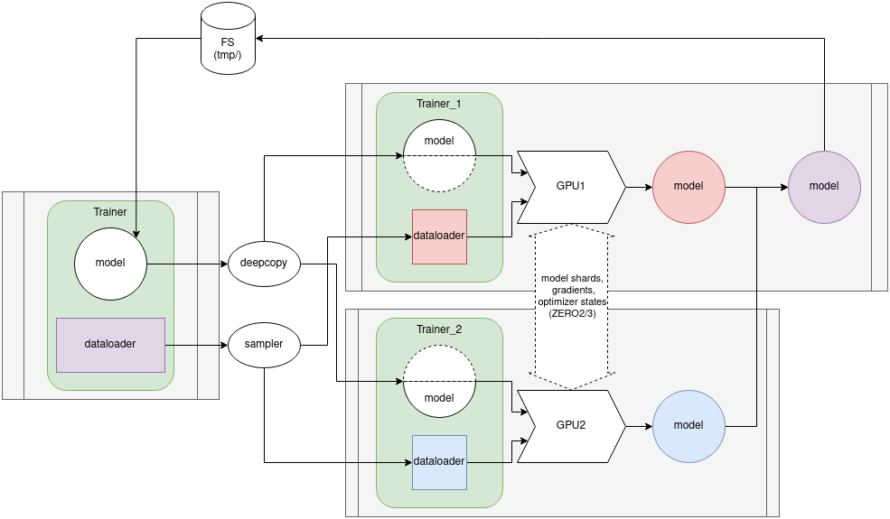
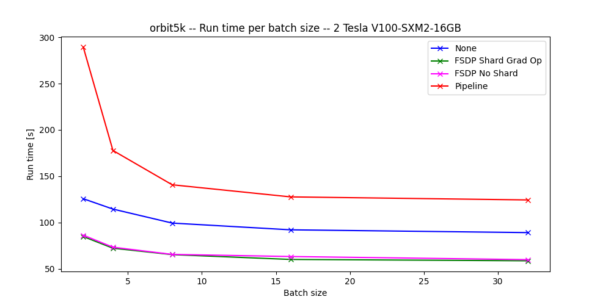
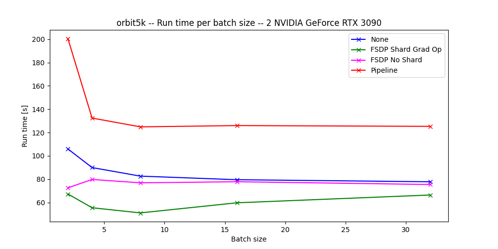
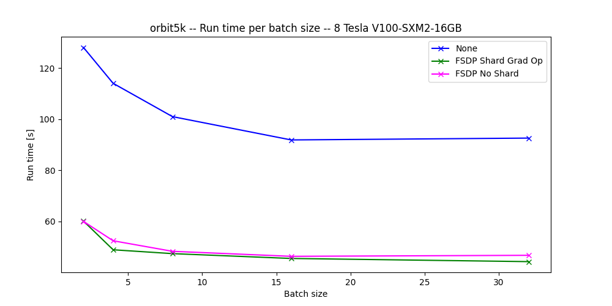
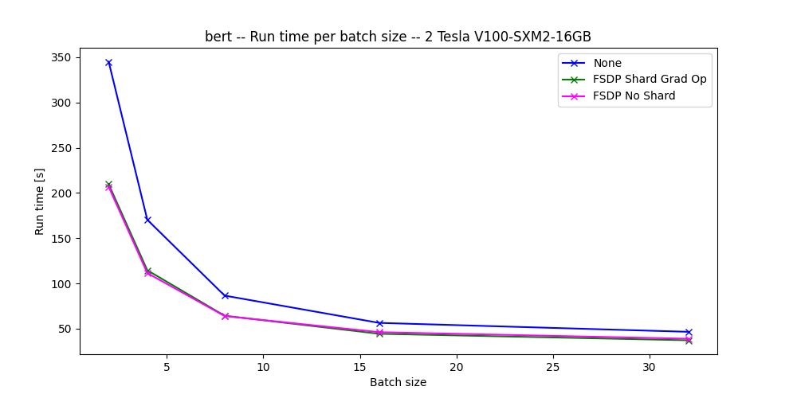
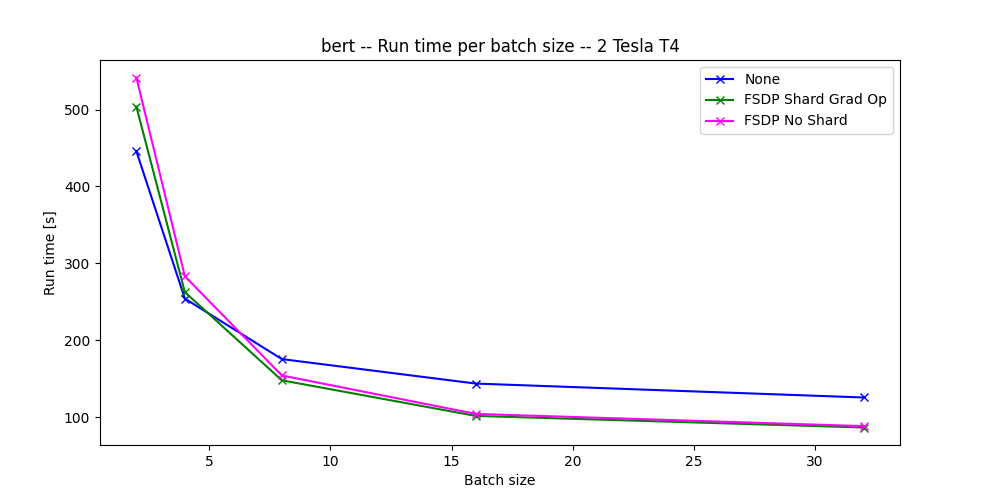
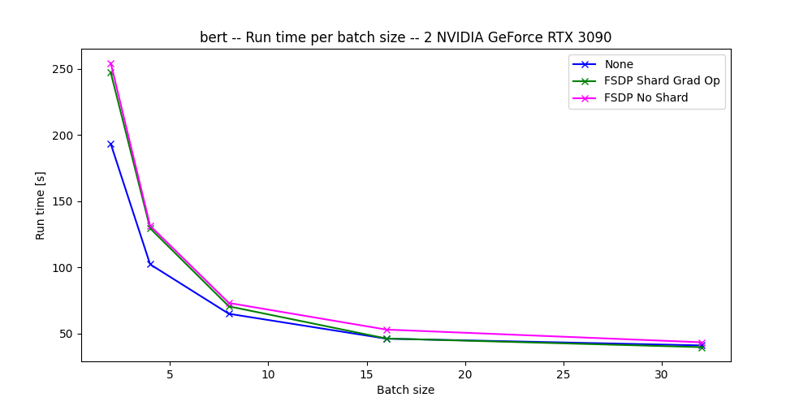
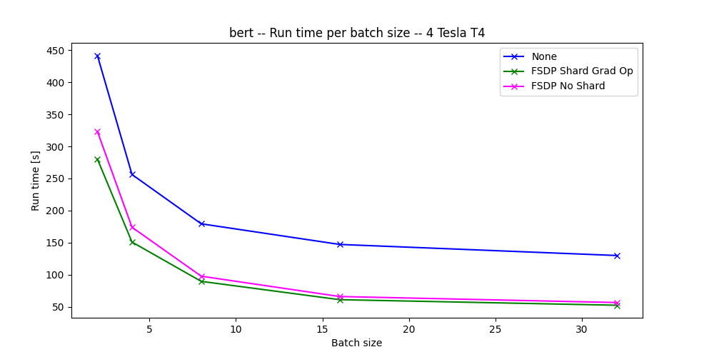
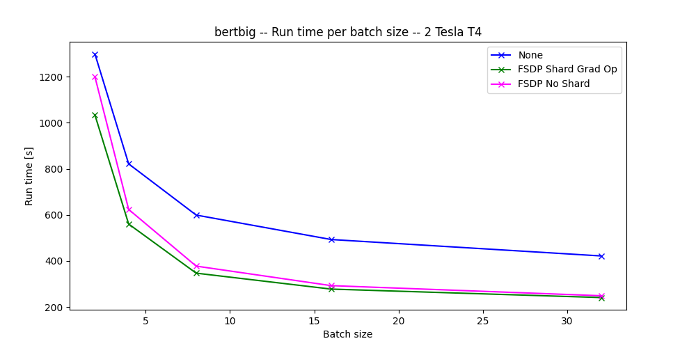

.. _FSDP documentation: https://pytorch.org/docs/stable/fsdp.html
.. _FSDP tutorial: https://pytorch.org/tutorials/intermediate/FSDP_tutorial.html#how-fsdp-works
.. _Advanced FSDP tutorial: https://pytorch.org/tutorials/intermediate/FSDP_adavnced_tutorial.html
.. _FSDP wrappers: https://github.com/pytorch/pytorch/blob/main/torch/distributed/fsdp/wrap.py
.. _Python pickler guidelines: https://docs.python.org/3/library/pickle.html#what-can-be-pickled-and-unpickled
.. _Data Parallelism: https://lightning.ai/courses/deep-learning-fundamentals/9.0-overview-techniques-for-speeding-up-model-training/unit-9.3-deep-dive-into-data-parallelism/
.. _ZeRO: https://arxiv.org/abs/1910.02054

.. _parallel:

#####################
Parallel training
#####################

************
Introduction
************

When multiple GPUs are available, it is possible to use more than one to train the same model. Currently, two methods of multi-GPU training are available in giotto-deep and provide different benefits: `Data parallelism`_ and Pipeline parallelism

**********************
Data parallelism: FSDP
**********************

Data parallelism consists in training multiple copies of the model on partitions of the dataset. For example: one GPU may be responsible for training one copy of the model on one half of the training dataset while another trains another copy on the second half of the dataset. At the end or multiple times during a training epoch, both copies are merged to obtain a new model technically trained on the whole dataset. This method relies on the assumption that the merging of the half-trained models is fast enough and results in good enough improvements to compensate the half-training. The principle is the same for more GPUs but the performance may not improve significantly past a certain point. This method is called Distributed Data Parallelism (DDP)

A more complex method consists in sharding the model to distribute it across multiple GPUs. During the training, one GPU can request the shard it needs from the GPU responsible for this shard, do its calculations and then discard the shard. Once the gradients for this shard is calculated in the backward pass, the shard is retrieved again, calculations are done and the updated shard is sent back to the responsible GPU (as explained in the `FSDP tutorial`_). More communication between the GPUs is required as a result but this approach results in lower peak memory use. This algorithm is called `ZeRO`_ and exists in 2 variants in pytorch's FSDP feature: ZERO2 (SHARD_GRAD_OP) doesn't discard the shard after the forward pass and thus saves time in communication but requires more memory, ZERO3 (FULL_SHARD) discards the shard everytime after it is done with its calculations and thus requires more communication but less memory. In itself, using one of those 2 algorithms may not result in better training time but the freed memory can be used to increase the batch size (which usually results in faster epochs) or increase the size of the model

Some optimisations allow those algorithms to increase in performance even more:
* Mixed precision: Converts the weights, gradients or the transmitted data to a lower precision to speed up calculation (potentially using the hardware support of the GPU) or transmission of data between the GPUs
* Backward prefetch: Allows shards to be recovered in different ways to optimise memory usage or performance
* ...
More optimisations are discussed in the `Advanced FSDP tutorial`_ 

The Data parallelism algorithms and optimisations to use are very dependant on the model and training method but can sensibly improve the training time when chosen and configured correctly. 

===============================
Implementation into giotto-deep
===============================

Those algorithms are implemented into giotto-deep using pytorch's FSDP tool. The implementation's architecture is explained in the diagram below. 

What the diagram shows is that for each device used for the training, giotto-deep's Trainer will create a new process that executes a subinstance of Trainer. The members of the base instance (model, dataloaders,...) are deepcopied into the subinstances so each subinstance may work on its members without affecting the other processes. Contrary to a classic copy (sometimes called shallow copy) that only copies the references present in the object being copied, deep copies copy the memory content of the object into new memory. This process is more complex as it is recursive (referenced objects must be deepcopied too) but allow for truly independant copies that do not risk being invalidated by changes made to the original object. The training occurs on each process on its dedicated device using the part of the dataloader assigned to it thanks to a sampler. Once the training is complete, the partially trained models are "aggregated" to form a new model technically trained on the whole dataset. The model is then retrieved by the subprocess with rank 0 and stored in a temporary file where it is recovered by the base instance to update the model.

This architecture was selected because it was the best compromise between the amount of changes that needed to be made to the API and inner workings of giotto-deep, the amount of changes necessary in the user's code and the flexibility in FSDP's confguration. Less changes would have been required to the Trainer had we chosen to simply make it compatible with torchrun (pytorch utility script to launch a python script in multiple processes) but some adaptations still would have been necessary not to break necessary features and this puts more work in the hands of the user. A simpler Trainer API to support parallelisation is possible but it comes at the expense of configurability which plays a crucial role in the performance of FSDP

However, the implementation choices made come with a few limitations:

* Most examples of "native" FSDP (FSDP not used in a library) that can be found online show the model and dataset being instanced in each subprocess. This allows each subprocess to possess an independant instance of the model and dataloader. However, due to giotto-deep's API which expects to be given already instanced model and dataset, this wasn't possible. 
* In order to use FSDP within giotto-deep nonetheless, we had to deepcopy and send the received instances of the model and dataloaders to each subprocess. This means that the dataloaders and models MUST be serialisable using pytorch's pickler (`Python pickler guidelines`_). 
* Currently, some features of Pytorch (ex:Map_style_dataset) and giotto-deep (ex:TransformingDataset) aren't serialisable and thus cannot be used as is when trying to train a model with FSDP through giotto-deep. 

===============================
Using FSDP with giotto-deep
===============================

To use one of those algorithms, import and instantiate the `Parallelism` class with the following informations:

* p_type: The algorithm to use, defined in the `ParallelismType` enum

    * `PIPELINE`
    * `FSDP`
* devices: List of the GPUs available on the machine. The list can be generated using `list(range(torch.cuda.device_count()))`. If no list is provided, the class will look for the devices itself
* nb_device: The actual number of GPUs from the devices list to use for the training. Not providing this parameter or providing a value smaller than 1 results in all the devices (found or provided) to be used. Values higher than the number of devices (found or provided) will result in an error
* config_fsdp: Dictionnary containing the arguments for the instantiation of FullyShardedDataParallel as per the official `FSDP documentation`_. This allows the user to configure FSDP as he wishes. The device_id parameter of FSDP is automatically handled

The instance can then be given to the `parallel` argument of the `train` function

.. code-block::

    # FSDP not used for training
    valloss, valacc = train.train(SGD, 
                                  args.n_epochs, 
                                  args.cv, 
                                  {"lr": 0.001, "momentum": 0.9})

    # FSDP configured and used for training
    devices = list(range(torch.cuda.device_count()))

    config_fsdp = {
        "sharding_strategy": ShardingStrategy.SHARD_GRAD_OP,
        "auto_wrap_policy": always_wrap_policy,
        }

    
    parallelism = Parallelism(ParallelismType.FSDP,
                                devices, 
                                len(devices),
                                config_fsdp=config_fsdp)

    valloss, valacc = train.train(SGD, 
                                  args.n_epochs, 
                                  args.cv, 
                                  {"lr": 0.001, "momentum": 0.9},
                                  parallel=parallelism)

FSDP in giotto-deep works with profiling and cross-validation but not with parallel TPUs. 

.. warning::
    As FSDP uses multiprocessing, it is necessary to use the idiom `if __name__ == __main__:` for the main code. This also implies that the model and datasets should be serialisable (which is not the case of 'to_map_style_dataset' datasets for example)

.. warning::
    When using FSDP with a sharding strategy that isn't `NO_SHARD` (DDP), always provide a wrapper found in `FSDP wrappers`_ or an appropriate Callable. Wrappers are Callables that take a module and return a boolean to indicate if this module should be sharded based on some rule. Not using any wrapper when trying to shard will behave as if no parallelism is used at all

.. note::
    When using FSDP, the batch size given to the dataloader is used by each GPU. For example, using a batch size of 4 with FSDP and 2 GPUs effectively corresponds to using a batch size of 8 without FSDP

.. note::
    FSDP's ability to accelerate the training of a model depends on the model and FSDP's configuration. Giotto-deep provides a working (although with some caveats) implementation but some modifications to the model as well as some trial and error with the configuration may be needed in order to fully profit off its capabilities

=========================
Compatibility adaptations
=========================

Due to some constraints posed by giotto-deep's API, some models aren't compatible as is with giotto-deep and/or its FSDP implementation. Two such examples are
* Huggingface's T5 model: giotto-deep expects the model to take what comes out of the dataset as is (if a simple tensor is given) or in order (if a list of tensor is given) but this model can do different things depending on which parameters are fed in its forward method. This implies that the received list of tensor may be given to the first, third and sixth parameter of the forward method (for example). Giotto-deep doesn't allow such "argument juggling". Moreover, giotto-deep expects the loss of a given prediction to be calculated by giotto-deep itself using a provided loss_fn function. T5, however, provides the loss for the current prediction as a member of the dictionnary returned by the forward method. 
* Giotto-deep's QATransformer model: This model heavily relies on some features that aren't serializable. However, our implementation of FSDP into giotto-deep relies on serialisation due to giotto-deep's Trainer API that requires the provided datasets and model to be already instanced. FSDP, on the other hand, needs to do its work on different instances of the dataset and model, so a lot of examples show each process instantiating their own copy of the model and dataset. In our implementation, we decided to deepcopy the Trainer's parameters and send them to each process to make sure each process has an independant copy of what it needs but this requires the used features and classes to be serializable and a lot of them aren't in this example

However, in order to provide more example models for FSDP, attempts were made to adapt giotto-deep or even pytorch to respect those constraints. Each modification made for those models are listed here (as well as their result) in the hope that they may provide some insight into what needs to be done going forward for the development of giotto-deep.

* T5 
    * **Trainer's ``__init__``**: Allow for an optionnal loss_fn. The absence of loss function serves as condition in the rest of the code to detect that we are training the T5 model
    * **Method ``_send_to_device``**: When given a list of tensors without loss_fn, send tensors 0, 1 and 2 to ``input_ids``, ``attention_mask`` and ``labels`` respectively
    * **Method ``_inner_train_loop``**: After ``_send_to_device`` when training T5, ``pred`` is a dict which contains ``logits`` and ``loss`` which must be stored in ``pred`` and ``loss`` respectively for the rest of the computation to work
    * **Bypass model return and validation**: T5 training is only used for benchmarking and thus do not require the model to be returned or validated
    * Result: trainable model but accuracy results are off and recovering the state_dict to store the model once trained blocks the program ad eternam. Only usable for benchmarking, to prove that FSDP's implementation inside giotto-deep is functionnal
* QATransformer
    * **Make ``_MapStyleDataset`` picklable**: Torchtext provides a ``to_map_style_dataset`` function that transforms an iterable dataset into a map dataset (see pytorch's documentation for more info on the different dataset types). However, the ``_MapStyleDataset`` class it uses is defined inside the function which makes it unpicklable. Simply moving the class definition out of the function fixes the problem
    * **Make ``TransformingDataset`` picklable**: Setting up serialisation for this class requires ``__getstate__`` and ``__setstate__`` methods to be defined
    * **Make question_answering.py's classes and functions picklable**: Make sure all classes and functions used in the file are declared at the root of the file to make them picklable
    * Result: Model not functionnal due to FSDP generating sparse tensors for unknown reasons. Sparse tensors do not implement ``backward`` which results in an error

==============
Known problems
==============

* Using FSPD with ``FULL_SHARD`` sharding strategy trains without problems but renders the program idle ad eternam once the trained model is returned using ``state_dict`` (trainer.py: ``parallel_train``). To minimize the risks of problems, only use ``SHARD_GRAD_OP`` or ``NO_SHARD`` sharding strategies. 
* With some models, FSDP generates sparse tensors which don't implement ``backward`` and thus raise errors

***********************************
Benchmarks
***********************************

Benchmarks were run on several multi-GPUs configurations to show and measure the benefit of the proposed parallelisation strategies.

The system configurations used are:

- 2x `Nvidia GeForce RTX 3090 <https://www.nvidia.com/en-eu/geforce/graphics-cards/30-series/rtx-3090-3090ti/>`__ on a local machine
  with NVIDIA-SMI 525.147.05, Driver Version: 525.147.05, CUDA Version: 12.0
- 2-4x `Nvidia Tesla T4 <https://www.nvidia.com/en-us/data-center/tesla-t4/>`__ on `Google Kubernetes Engine <https://cloud.google.com/kubernetes-engine/docs/how-to/gpus>`__
  with a Docker image based on `nvidia/cuda:12.2.0-runtime-ubuntu22.04 <https://hub.docker.com/r/nvidia/cuda/tags?page=1&name=12.2.0-runtime-ubuntu22.04>`__
- 2-8x `Nvidia V100 <https://www.nvidia.com/en-us/data-center/v100/>`__ on `Google Kubernetes Engine <https://cloud.google.com/kubernetes-engine/docs/how-to/gpus>`__
  with a Docker image based on `nvidia/cuda:12.2.0-runtime-ubuntu22.04 <https://hub.docker.com/r/nvidia/cuda/tags?page=1&name=12.2.0-runtime-ubuntu22.04>`__

The benchmark environment is available within this repository in folder :file:`benchmark/`.
The main script is :file:`benchmark.py` which executes pre-configured models in a standard way to measure the execution time of a model while
changing the batch size and parallelisation technique. The model and the number of GPUs is given as input.
The script adapts the model's arguments according to the needs of the model.
Figures are output to show the execution time vs batch size for every parallelisation technique.
A second batch of figures can be created once all benchmarks are finished; this allows to combine several single results to, for example,
show executions on different number of GPUs on the same graph.

Other interesting scripts are :file:`genpods.py` and :file:`Dockerfile` which are able to generate Kubernetes pods and Docker images to execute the benchmarks in a Kubernetes cluster.

The parallelisation techniques, that are also written as legend on the figures presented in this chapter, are:

- *None*: the model was run on one GPU (without parallelisation)
- *FSDP Shard Grad Op*: the model was run on multiple GPUs using FSDP Shard Grad Op
- *FSDP No Shard*: the model was run on multiple GPUs using FSDP No Shard
- *Pipeline*: the model was run on multiple GPUs using the `pipeline tools <https://github.com/giotto-ai/pipeline-tools/>`__

The default batch sizes are 2, 4, 8, 16, and 32. Each model is trained for 3 epochs.

===============================
Orbit 5k
===============================

For model orbit 5k, the benchmark environment exploits the example :file:`examples/parallel_orbit_5k.py`.

On :numref:`benchmark-orbit5-2v100`, 3 distinct behaviours come out.
The line on the top, drawn by the pipeline execution, is the slowest execution. This is expected as the pipeline was designed to increase the total amount of memory used by the model instead of running the model faster.
The line in the middle, drawn by the non-parallel execution, shows the time required to train the model on one GPU.
The line at the bottom, drawn by the two FSDP executions, show that sharding the model on two GPUs reduces the execution time.

.. _benchmark-orbit5-2v100:

   Orbit5k --- 2x V100

On :numref:`benchmark-orbit5-2rtx3090`, the behaviour is the same for the pipeline and non-parallel executions.
The FSDP executions differ, however. And the execution with FSDP Shard Grad Op tends to join the non-parallel line.
This behaviour simply shows that, depending on the model and on the GPUs (available memory), different results are possible.

.. _benchmark-orbit5-2rtx3090:

   Orbit5k --- 2x GeForce RTX 3090

:numref:`benchmark-orbit5-8v100` shows the difference between the non-parallel execution and the FSDP executions on 8 GPUs.

.. _benchmark-orbit5-8v100:

   Orbit5k --- 8x V100

The orbit 5k is small and there is limited benefit to parallelise its execution.
However, it stays a good example and runs smoothly with ``giotto-deep``.

===============================
BERT
===============================

For model BERT, the benchmark environment exploits the example :file:`examples/parallel_bert.py`.

:numref:`benchmark-bert-2v100`, :numref:`benchmark-bert-2t4`, and :numref:`benchmark-bert-2rtx3090` present the execution of the BERT model on two GPUs, on V100, on T4 and on RTX 3090.
These three figures show again that the results of a model may depend on the GPU model used.

.. _benchmark-bert-2v100:

    BERT --- 2x V100

.. _benchmark-bert-2t4:

    BERT --- 2x Tesla T4

.. _benchmark-bert-2rtx3090:

   BERT --- 2x GeForce RTX 3090

:numref:`benchmark-bert-4t4` and :numref:`benchmark-bertbig-2t4` present the execution of BERT on 4x Tesla T4 and BERT Big on 2x Tesla T4.
Each time showing an improvement of the execution time when using parallelisation.

.. _benchmark-bert-4t4:

    BERT --- 4x Tesla T4

.. _benchmark-bertbig-2t4:

    BERT Big --- 2x Tesla T4

===============================
Conclusion
===============================

The user is, in most cases, able to reduce the compute time with multiple GPUs.
The mileage varies, however, with the model specific features.
The parallelisation capacity of the model is thus a key element.
