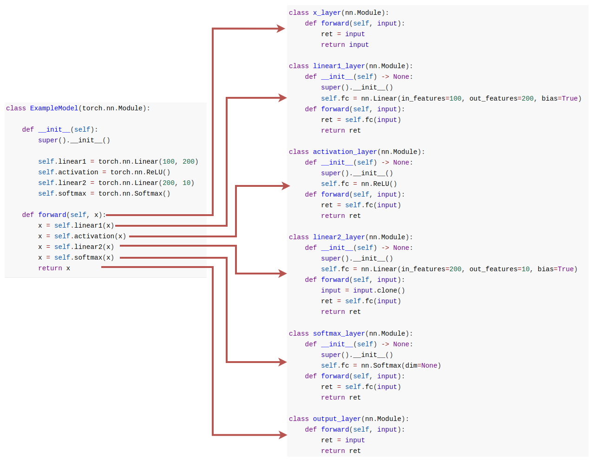

# Pipeline tool

## Table des matières

[toc]

## Introduction 

Le domaine du machine learning est en constante évolution, avec des modèles de plus en plus sophistiqués et des ensembles de données de plus en plus volumineux. Des défis considérables peuvent se poser pour les professionnels du domaine, notamment lorsqu'il s'agit d'entraîner des modèles qui sont trop volumineux pour tenir dans la mémoire d'une seule GPU.

Dans ce contexte, un outil a été développé pour diviser un modèle de machine learning PyTorch sur plusieurs GPU, sans altérer le processus d'entraînement. La description du modèle PyTorch est prise en entrée, chaque couche est interprétée de manière indépendante, et le modèle est réécrit en gérant les interdépendances des opérations. Le résultat est une séparation en pipeline entre plusieurs GPU qui ne compromet pas la qualité des résultats.

Dans ce document, le fonctionnement de cet outil sera examiné en détail, ainsi que les avantages qu'il peut offrir aux professionnels du machine learning cherchant à entraîner des modèles volumineux et complexes.

## Fonctionnement 


### Premiers pas 

L'outil prend en paramètre : 

- Un modèle PyTorch
- Un nombre de GPU

Il est nécessaire que le modèle PyTorch contienne exclusivement des Modules/fonctions fournies par l'API de PyTorch. Il est cependant possible de créer son propre module qui comporte des modules PyTorch. Par exemple, il n'est pas possible de créer la propre convolution et de l'utiliser comme layer. 

Si le nombre de GPU n'est pas précisé, une détection du nombre de GPU est effectuée, et le modèle sera alors entraîné sur le maximum de GPU trouvés.


Pour utiliser l'outil, les includes suivants sont requis : 

```python
from torch.distributed.pipeline.sync import Pipe 
from pipeline_tool.pipeline_tool import SkippableTracing
```

Après avoir décrit le modèle souhaité, il suffit d'effectuer les appels suivants :

```python
trace = SkippableTracing(2, model)
model = trace.get_modules()
```

Le modèle est ainsi tracé à l'aide de [torch.fx](https://pytorch.org/docs/stable/fx.html) pour obtenir le GraphModule, cela permet de connaître, pour chaque module, son type, ses paramètres, ses fonctions (par exemple : convolution, activation, multiplication) et ses liens avec les autres modules.

Voici le résultat du processus sur un modèle très simple :



Dans cet exemple nous avons un modèle composé uniquement de Module torch. Afin de pouvoir les décrire correctement nous exploitons la trace générée par torch fx.

Trace générée :

```bash
Opcode          Name            Target         
placeholder     x               x              
call_module     linear1         linear1        
call_module     activation      activation     
call_module     linear2         linear2        
call_module     softmax         softmax        
output          output          output  
```

 La trace détecte chaque layer généré nous donne : 

- Un opcode définissant le type d'opération.
- Un nom correspondant directement au fonction qu'elle fait.
- Une target qui correspond au nom que l'on peut retrouver dans une description de modèle pytorch.

Nous pouvons donc exploiter ces données pour faire correspondre les noms "target" avec les noms du model et ainsi récupérer la déclaration des modules utilisés :

```bash
Name            Module declaration
linear1         Linear(in_features=100, out_features=200, bias=True)
activation      ReLU()         
linear2         Linear(in_features=200, out_features=10, bias=True)
softmax         Softmax(dim=None)
```

La récupération, l'analyse et la gestion de toutes ces informations permettent de générer un fichier qui contient un modèle prêt pour un entraînement pipeliné sur N GPUs.


### Modèles complexes 

Malheureusement, un modèle ne se limite jamais à une simple suite linéaire de modules prenant en entrée la sortie de l'opération précédente... Des modèles plus complexes existent, et il est nécessaire de gérer tous les cas possible, de correctement tracer le modèle, pour que celui-ci soit reproduit fidèlement sans omettre certaines opérations.

De fait, il est nécessaire de différencier les modules PyTorch des autres éléments. 

Nous analysons le modèle reçu en paramètre et stockons les éléments par leur nom dans un dictionnaire, que nous utilisons pour créer une table de correspondance avec les noms donnés par la trace.

Nous pouvons ensuite itérer sur la trace générée pour différencier cinq types de couches  :

1. <u>**Module**</u> : doivent être initialisées et ont donc besoin de leur description récupérée à partir du modèle d'origine.
2. <u>**Fonction**</u> : correspondent à des fonctions simples de PyTorch exécutées entre des tenseurs ou sur un tenseur (par exemple : des additions, des suppressions de dimensions, etc.).
3. <u>**Getitem**</u> :  apparaissent dans la trace lorsqu'une seule partie d'un résultat sous forme de liste doit être récupérée (par exemple, l'index 1 d'une liste ou la première valeur de retour d'une fonction).
4. <u>**Getattr**</u> : correspondent à la récupération d'un attribut d'un tenseur.
5. <u>**Propagation**</u> : apparaissent dans la trace pour propager les tenseurs vers d'autres couches.


#### call_function

Un des modèles les plus connus : ResNet

Si l'on récupère la trace générée, un nouvel opcode apparaît :

```bash
Opcode               Name                           Arguments                     
placeholder          x                              ()                            
call_module          flow_0_conv1                   (x,)                          
[...]  
call_module          flow_0_avgpool                 (flow_0_layer4_1_relu_1,)   
# ############################################################################################
call_function        flatten                        (flow_0_avgpool, 1) 
# ############################################################################################
call_module          flow_0_fc                      (flatten,)                    
call_module          flow_1                         (flow_0_fc,)                  
output               output                         (flow_1,)    
```

*Cette sortie affiche aussi les arguments que prennent les couches.*

Les call_functions sont traitées différemment des call_modules et vont donc générer un code différent. Cependant, chaque call_function va aussi générer un module qui ne va faire que cette opération.

```python
class flatten_layer(nn.Module):
    def forward(self, input):
        ret = torch.flatten(input, 1)
        return ret
```

Les fonctions n'ont pas besoin de fonction d'initialisation. Pour les créer l'outil va rechercher avec le nom donné par la trace, la fonction torch correspondante. Dans l'exemple du modèle ResNet18 instancié, "flatten" est une fonction existante dans l'API de torch.  

La trace nous permet d'identifier les arguments passés à cette fonction. Dans le cas ci-dessus, les inputs sont, la sortie de la couche précédente et l'entier "1".


#### Propagation

 Si l'on s'attarde sur les arguments de la call_function entourée de commentaires, un des arguments est la sortie d'une couche précédente. L'outil va donc mémoriser cette dépendance et récupérer la sortie correspondante. Dont voici la trace :


```bash
Opcode               Name                           Arguments                     
placeholder          x                              ()                            
call_module          flow_0_conv1                   (x,)                          
[...]              
call_module          flow_0_maxpool                 (flow_0_relu,)                
call_module          flow_0_layer1_0_conv1          (flow_0_maxpool,)             
call_module          flow_0_layer1_0_bn1            (flow_0_layer1_0_conv1,)      
call_module          flow_0_layer1_0_relu           (flow_0_layer1_0_bn1,)        
call_module          flow_0_layer1_0_conv2          (flow_0_layer1_0_relu,)       
call_module          flow_0_layer1_0_bn2            (flow_0_layer1_0_conv2,) 
#############################################################################################
call_function        add                            (flow_0_layer1_0_bn2, flow_0_maxpool)
#############################################################################################
call_module          flow_0_layer1_0_relu_1         (add,)                        
[...]          
call_module          flow_0_fc                      (flatten,)                    
call_module          flow_1                         (flow_0_fc,)                  
output               output                         (flow_1,)    
```


Le code généré est différent, l'utilisation du décorateur "skippable" est nécessaire afin de propager les sorties des couches a d'autres non contigus.


```python
[...]

@skippable(stash=['flow_0_maxpool_to_add'])
class flow_0_maxpool_layer(nn.Module):
    def __init__(self) -> None:
        super().__init__()
        self.fc = nn.MaxPool2d(kernel_size=3, stride=2, padding=1, dilation=1, ceil_mode=False)
    def forward(self, input):
        ret = self.fc(input)
        yield stash('flow_0_maxpool_to_add', ret)
        return ret

[...]

class flow_0_layer1_0_bn2_layer(nn.Module):
    def __init__(self) -> None:
        super().__init__()
        self.fc = nn.BatchNorm2d(64, eps=1e-05, momentum=0.1, affine=True, track_running_stats=True)
    def forward(self, input):
        ret = self.fc(input)
        return ret

@skippable(pop=['flow_0_maxpool_to_add'])
class add_layer(nn.Module):
    def forward(self, input):
        flow_0_maxpool = yield pop('flow_0_maxpool_to_add')
        ret = torch.add(input, flow_0_maxpool)
        return ret
    
[...]
```

#### Getitem

Getitem nous permet de récupérer un index précis d'une tensor. Par example si on s'intéresse a cette trace :

```bash
[...]
call_function        getattr_1                                                              (add_3, 'shape')              
call_function        getitem_4                                                              (getattr_1, 0)                
[...]
```

Nous voyons qu'un getitem apparait et qu'il va être fait sur le getattr le précédent. Traduit cela donnerai `add_3.shape[0]`

Nous devons à chaque "call_function" nommée getattr intéragir avec les couches présentes dans son premiers arguments. Avec cela on peut éviter la propagation de valeur non tenseur dans le modèle et aussi une simplicité dans la lecture.

#### Getattr

Il y a deux types de "getattr" différents : 

1. **Ceux ayant l'opcode "call_function" et nommés "getattr".** Ces derniers apparaissent lorsque un attribut d'un module est demandé.

   ```bash
   [...]
   call_function        getattr_1                                                              (add_3, 'shape') 
   [...]
   call_module          model_pooling_layer_scaled_dot_product_attention                       (expand, add_3, add_3)  
   ```

   L'output d'une opération d'un layer fourni toujours en sortie un tensor, et c'est ce tensor qui sera propagé (couche suivante ou plus loin). Cette information nous permet de récupérer certaines spécificités du tensor, qui est en générale utilisée comme paramètre d'une fonction ou d'un module. Ainsi, ce n'est pas un nouveau module qui sera créé, mais il faudra faire référence au bon attribut du tensor lorsque celui-ci sera passé en paramètre. 

   Voici un exemple de code généré pour illustrer cette explication : 

   ```py
   [...]
   @skippable(stash=['add_3_to_expand', 'add_3_to_model_pooling_layer_scaled_dot_product_attention'], pop=['add_2_to_add_3'])
   class add_3_layer(nn.Module):
       def forward(self, input):
           add_2 = yield pop('add_2_to_add_3')
           ret = torch.add(input, add_2)
           yield stash('add_3_to_expand', ret)
           yield stash('add_3_to_model_pooling_layer_scaled_dot_product_attention', ret)
           return ret
   [...]
   @skippable(pop=['add_3_to_expand'])
   class expand_layer(nn.Module):
       def forward(self, input):
           add_3 = yield pop('add_3_to_expand')
           ret = input.expand(add_3.shape[0], -1, -1)
           return ret
   ```

2. **Ceux ayant l'opcode "get_attr".** Ces derniers apparaissent lorsque un attribut privé d'une classe, créé par l'utilisateur, est demandé.

   ```bash
   get_attr             model_pooling_layer_query                                              () 
   ```

   Dans ce cas nous sommes obligé de créer un module qui intialisera l'attribut afin de pouvoir le propager/l'utiliser. Nous n'avons comme information que ce nom est devons donc le rechercher dans le modèle fournit afin de pouvoir le recréer à l'identique. 

   Voici un example de code qui illustre le cas : 
   ```python
   class model_pooling_layer_query_layer(nn.Module):
       def __init__(self) -> None:
           super().__init__()
           self.fc = nn.parameter.Parameter(torch.Tensor(1, 16), requires_grad=True)
       def forward(self, input):
           ret = self.fc
           return ret
   ```

#### Traitement MultiHeadAttention

Une gestion imprévisible est toutefois nécessaire pour les  MultiHeadAttention. Pendant la phase de récupération des déclarations  des modules, il est impossible de récupérer celles des  MultiHeadAttention. Par conséquent, l'utilisateur doit fournir un  dictionnaire contenant la description de tous les paramètres et leur valeurs des MultiHeadAttention de son modèle lors de l'initialisation de l'outil.

Au minimum doivent être fournit comme paramètres pour un MultiHead :

- embed_dim
- num_heads

Et l'intilisation serait changée en  : 
```python
configs = [{'embed_dim': hidden_val, 'num_heads': heads_val, 'dropout': 0.1, 'batch_first': True},
            {'embed_dim': hidden_val, 'num_heads': heads_val, 'dropout': 0.1, 'batch_first': True},
            {'embed_dim': hidden_val, 'num_heads': heads_val, 'dropout': 0.1, 'batch_first': True},
            {'embed_dim': hidden_val, 'num_heads': heads_val, 'dropout': 0.1, 'batch_first': True},
            {'embed_dim': hidden_val, 'num_heads': heads_val, 'dropout': 0.1, 'batch_first': True}]
nb_gpus = 2
trace = SkippableTracing(nb_gpus, model, configs)
model_pipe = trace.get_modules()
```


## Profiling

